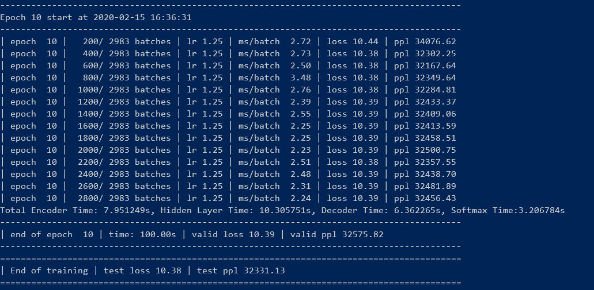

# NTU MSAI AI6127 Assignment 1 Answer Sheet

Note: For Prof, TA, other NTU students information,
all the code here are modified based this [example](https://github.com/pytorch/examples/tree/master/word_language_model)

- **Deep_NLP_Assignment1.pdf** is the assignment requirement published by the professor
- In case the Github can not render the math eqution correctly, please refer to the [**AnswerSheet**](Answersheet.pdf)
- [**main_fnn.py**](main_fnn.py) is the script to execute the training process, the model hyper parameters are included in this file. this
file is modified based on the **main.py**
- [**model.pt**](model.pt) is generated by the [**main_fnn.py**](main_fnn.py)
- [**embedding_eval.py**](embedding_eval.py) is the script to generate [**spearmanr.csv**](spearmanr.csv), which contains the Spearman correlation required by the assignment. The empty Spearman correlation in the csv file means that one  or both of the word pair did not show in the input data set.

## Question 1 Proof:

In the multi-class logistic regression, the entropy loss function is:

$$Loss = -\sum_{k}^ny_k\log \hat{y_k}$$

 The predicted value is:

$$\hat{y_k} = \frac{e^{o_k}}{\sum_{i}{e^{o_i}}}$$
where $o_i = W_iz$ given the $z$ is the input vector to the GLM layer, $W$ is the matrix containing the associated weight vectors.
The Derivative of the predicted value is:

$$
\begin{aligned}
\frac{\partial \hat{y_k}}{\partial o_i}
&= \frac{\partial }{\partial o_i}\left(\frac{e^{o_k}}{\sum_{i}{e^{o_i}}}\right) \\\\
&= \frac{\frac {\partial e^{o_k}} {\partial o_i} \cdot \sum_{i}{e^{o_i}} - e^{o_k} \cdot e^{o_i}}{\left(\sum_{i}{e^{o_i}}\right)^2} \\\\
\end{aligned}
$$

when $i=k$, $\frac {\partial e^{o_k}} {\partial o_i} = e^{o_k}$,
when $i \neq k$, $\frac {\partial e^{o_k}} {\partial o_i} = 0$:
Thus

$$
\frac{\partial \hat{y_k}}{\partial o_i} =
\begin{cases}
    \hat{y_k}(1-\hat{y_k}),\quad i = k \\
    -\hat{y_k}\hat{y_i},\quad i \neq k
\end{cases}
$$
Combined with Loss function:

$$
\begin{aligned}
\frac {\partial Loss}{\partial o_i}
& = -\sum_{k}y_k \frac{\partial \log \hat{y_k}}{\partial o_i} \\
& = -\sum_{k}y_k \frac {1}{\hat{y_k}} \frac {\partial \hat{y_k}}{\partial o_i}\\
& = -y_i(1-\hat{y_i}) + \sum_{k \neq i }  \hat{y_i} {y_k} \\
& = -y_i + y_i\hat{y_i} + \sum_{k \neq i } \hat{y_i} {y_k} \\
& = \hat{y_i}({y_i} + \sum_{k \neq i }{y_i}) -y_i \\
& = \hat{y_i}(\sum_{k}y_k) -y_i \\
& = \hat{y_i} - y_i
\end{aligned}
$$

Given that $\frac {\partial o_i}{\partial W_i} = z$, we can get 

$$
\begin{aligned}
\frac{\partial Loss}{\partial W} =
\frac{\partial Loss}{\partial o_i} \frac{\partial o_i}{\partial W_i} =(\hat{y_i} - y_i)z
\end{aligned}
$$

## Question 2

### sub-question viii

According to the snapshot of the trainnig timer, we can know that the time cost on the backward is the most

### sub-question ix

Please refer to **spearmanr.csv** for the result

## Question 3

If the student are familiar with the machine learning, deep learning, python and pytorch, i guess it would take about one day to complete the assignment 
If the student has no idea of the above baisc knowledge, the time cost on the assignment would be much more longer, because it require student to pick up everything, probably would cost around a week (just finish the assignment, may not be understand the concept of the Embedding, FNN, RNN, pytorch etc.)